# software-project
Some code from software design classes. Below is the UML diagram of the projects in this repository.

## Prototipo

### Prototipo-01 

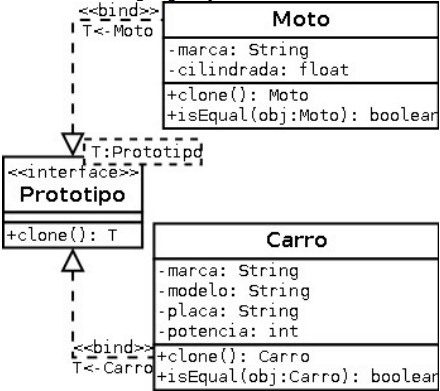

### Prototipo-02

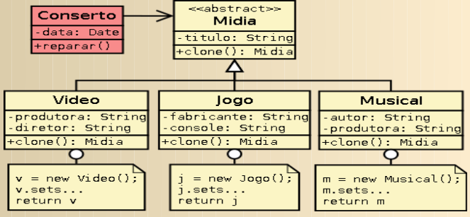

## Recordador

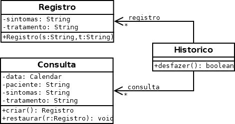

## Fábrica Abstrata

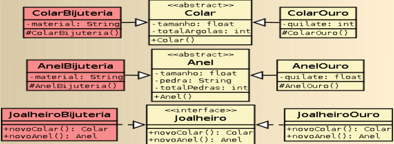

## Gabarito

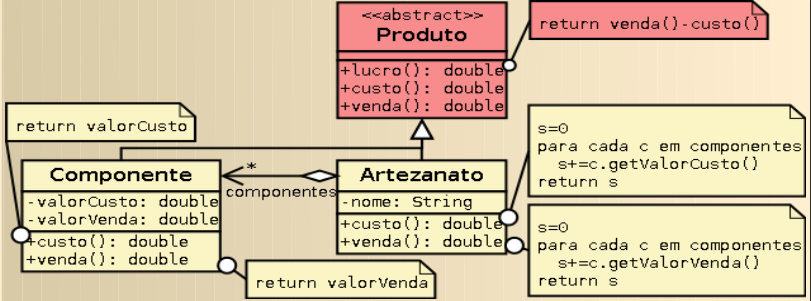

## Comando

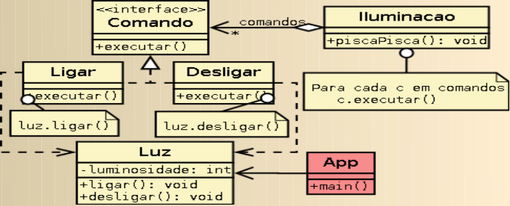

## Estrategia

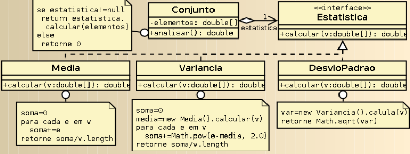

## Estado

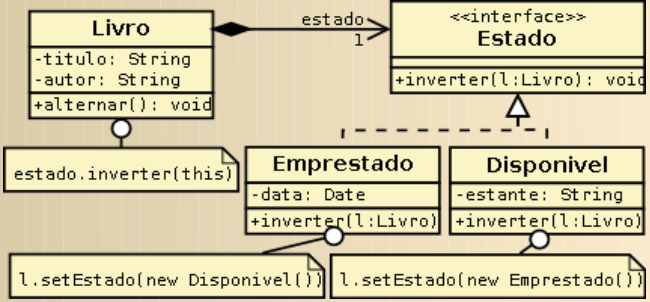

## Interpretador

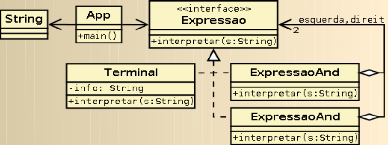

## Visitacao

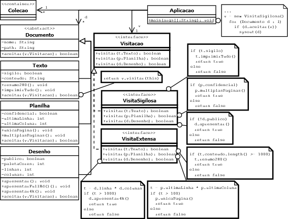

## Trabalho Final

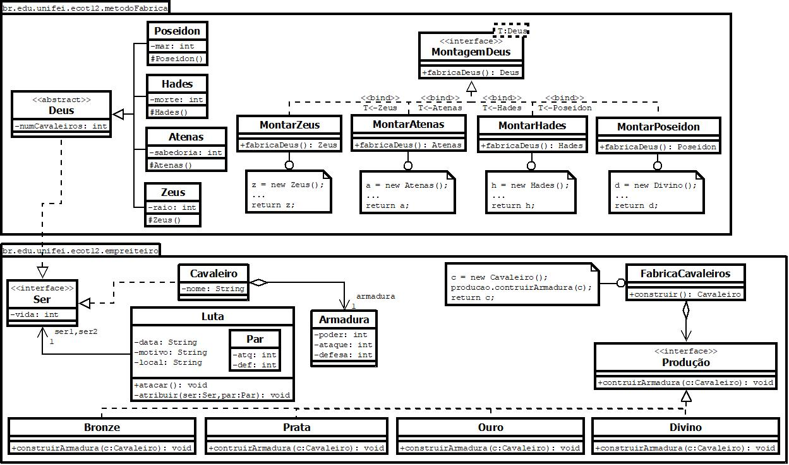
