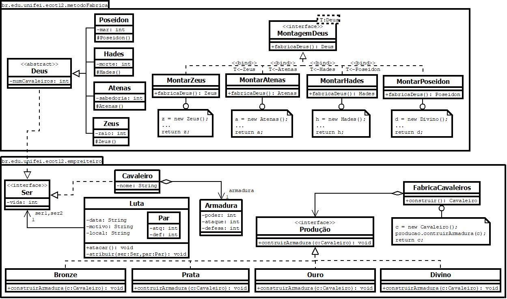

# software-project
Some code from software design classes. Below is the UML diagram of the projects in this repository.

## Prototipo

### Prototipo-01 

### Prototipo-02

## Recordador

## Fábrica Abstrata

## Gabarito

## Comando

## Estrategia

## Estado

## Interpretador

## Visitacao

## Trabalho Final

